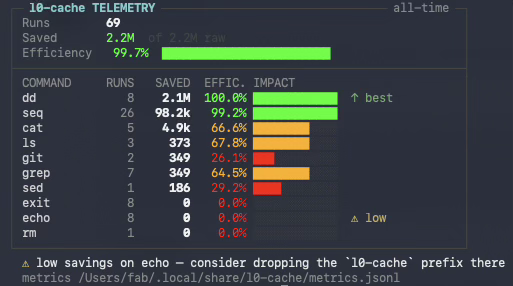

# l0-compressor

[](https://github.com/fabriziosalmi/l0-compressor/actions/workflows/ci.yml)
[](https://github.com/fabriziosalmi/l0-compressor/releases/latest)
[](LICENSE)
[](Cargo.toml)

A lightweight CLI proxy written in Rust that reduces LLM token consumption by
filtering, truncating, and compressing command output. Designed for AI coding
assistants (Claude Code, Gemini CLI, Cursor) running on macOS, Linux, and
remote servers.

<p align="center">
  
</p>

## The Problem

AI coding assistants read the full output of every shell command. A single
`cargo test` or `git log` can produce thousands of lines, consuming tokens
that add no value. The relevant information is almost always in the first
few lines (headers, command echo) and the last few lines (errors, summary).

## The Solution

`l0-compressor` wraps any command and applies a pipeline of universal filters:

```
command output
  --> ANSI escape stripping
  --> line collapsing (identical & prefix-based) (×N)
  --> unified-diff context collapsing (keep changes, drop unchanged runs)
  --> blank line squeezing
  --> head/tail buffering (30 + 30 lines)
  --> clean-success squelch (exit 0 + no error signal: trim the tail further)
  --> metrics logging
  --> filtered output
```

Typical savings: 50-80% fewer tokens per command invocation.

**Clean-success squelch:** on a zero exit with no error/warning signal anywhere
in the output, the tail window is trimmed further — a clean build/test/install's
middle is almost always progress noise, and the agent rarely needs 30 tail lines
to confirm success. The head (command echo) is always kept, the summary line
always survives, and the moment any `error`/`warn`/`fail`/`panic`/… signal
appears — or the command exits non-zero — the full tail is restored. Disable
with `--no-squelch` or `squelch = false` in config.

## How it compares

l0-compressor is **universal-first**: it compresses *any* command's output with generic,
format-aware filters instead of maintaining a parser per tool. That trades some
best-case ratio on well-known commands for zero per-tool maintenance and instant
support for unknown/proprietary CLIs. Where it stands apart is the *intelligence
around* the filtering.

| | l0-compressor | [rtk](https://github.com/rtk-ai/rtk) | [snip](https://github.com/edouard-claude/snip) | Lean Ctx |
|---|---|---|---|---|
| Filtering | universal + format-aware (head/tail, collapse, diff) | 100+ per-command parsers | 127 YAML filters | MCP server + cache |
| Works on unknown/custom commands | ✅ | partial | partial | partial |
| **Adaptive auto-tuning** (by exit code) | ✅ | ❌ | ❌ | ❌ |
| **Safety guard** (blocks dangerous cmds) | ✅ | ❌ | ❌ | ❌ |
| Full-output recovery on failure | ✅ `--recover` | ✅ | ❌ | ✅ (cache) |
| Transparent hook | Claude Code, Gemini CLI | many | many | MCP |
| Per-command config | JSON / TOML / YAML | TOML | YAML | — |
| Stats: dashboard / `--discover` / JSON | ✅ | ✅ | ✅ | partial |
| New runtime dependencies | none | none | none (Go) | — |

**Uniquely ours:** five-rule adaptive auto-tuning that learns per
`(cmd, args_hash)` bucket (failure backoff, two consecutive-decay tiers,
proactive shrink on long clean histories, steady-state decay on window-adaptive
truncation rate) and **persists** tuned `(head, tail, tail_error)` between
runs so the learning compounds — see [Adaptive
auto-tuning](#adaptive-auto-tuning). Plus a guard that blocks `rm -rf /` /
reverse shells / credential exfiltration / `DROP DATABASE`, systematic
credential redaction in telemetry, and tested hardening (bounded memory,
signal/process-group forwarding, OOM caps).

**Where the others win:** deeper per-command semantic output (e.g. grouped test
failures) and a longer list of pre-wired agents. For maximum ratio on a fixed set
of known commands, rtk/snip go further; for a safe, adaptive, zero-maintenance proxy
that works on *everything*, that's l0-compressor.

## Installation

### Prebuilt binary (no Rust needed)

Download a prebuilt binary for your platform (macOS arm64/x64, Linux x64) from the
latest release and install it to `~/.local/bin/` (with the `t` alias):

```sh
curl -fsSL https://raw.githubusercontent.com/fabriziosalmi/l0-compressor/master/install-binary.sh | sh
```

### Homebrew (macOS / Linux)

```sh
brew tap fabriziosalmi/l0-compressor https://github.com/fabriziosalmi/l0-compressor
brew install l0-compressor
```

### From source (non-interactive)

Builds with Rust/Cargo and installs to `~/.local/bin/`:

```sh
curl -fsSL https://raw.githubusercontent.com/fabriziosalmi/l0-compressor/master/install.sh | bash
```

### Interactive Installer

Clone the repository and run the setup script for a guided interactive install:

```sh
git clone https://github.com/fabriziosalmi/l0-compressor.git
cd l0-compressor
./install.sh
```

### Manual Build

```sh
cargo build --release
cp target/release/l0-compressor /usr/local/bin/
```

### Verify

```sh
l0-compressor --version
# l0-compressor 0.1.0 (abc1234)
```

## Usage

```sh
# Filtered output (default: 30 head + 30 tail, threshold 100 lines)
l0-compressor cargo test

# Full output, metrics still logged
l0-compressor --raw cargo test

# Interactive commands pass through unchanged
l0-compressor -i vim file.txt

# Token savings report
l0-compressor --stats
l0-compressor --stats --since 7d

# Custom head/tail
l0-compressor --head 50 --tail 50 cargo build

# More tail lines on error (default: 120)
l0-compressor --tail-error 200 cargo test

# Auto-tuning is enabled by default. To disable it:
l0-compressor --no-auto cargo test

# Diagnose system installation, shell configuration, and active LLM editors
l0-compressor --doctor

# Custom success optimization floor and failure backoff ceiling
l0-compressor --auto-floor 15 --auto-ceiling 500 cargo test

# Custom token divisor ratio (e.g. 8 bytes per token)
l0-compressor --token-factor 8 cargo test
```

## Options

```
--raw                Print output verbatim (no head/tail truncation, no collapsing
                     or JSON squashing); ANSI is still stripped and a 1 MB/line and
                     256 MB total OOM cap still apply. Metrics are still logged.
-i, --interactive    Passthrough mode (stdin/stdout/stderr inherited)
--head N             Lines to keep from start (default: 30)
--tail N             Lines to keep from end (default: 30)
--tail-error N       Tail lines on non-zero exit (default: 120)
--threshold N        Only truncate if output exceeds N lines (default: 100)
--only-errors        Keep only lines matching error/warn/fail/panic/exception/etc.
--recover            On a failing command whose output was truncated, save the full
                     output to a temp file and point to it in the banner (so the agent
                     can read the omitted lines without re-running). Off by default.
--idle-timeout N     SIGKILL the command (and its process group) after N seconds with
                     no output (prevents interactive-prompt deadlocks). 0 = off.
--no-auto            Disable adaptive auto-tuning of parameters
--quiet, -q          Suppress l0-compressor's own stderr notices (e.g. auto-tuning)
--guard              Force-enable the safety guard (see "Safety Guard" below)
--no-guard           Force-disable the safety guard
--doctor             Diagnose system installation, shell environment, and active LLM editors
--auto-floor N       Floor for success optimization decay (default: 10)
--auto-ceiling N     Ceiling for failure backoff tail expansion (default: 1000)
--token-factor N     Divisor for token estimation (default: 4)
--stats              Show token savings report
--since DURATION     Filter stats/discover (e.g. 7d, 24h, 30m)
--discover           Show an optimization advisory (keep / drop / footprint) from metrics
--json               Output --stats as JSON instead of the dashboard
--cost-per-mtok N    USD per million tokens; when > 0, show cost saved in --stats/--discover
--reset-stats        Delete ALL recorded telemetry (destructive, cannot be undone)
--completions SHELL  Generate shell completions (bash, zsh, fish, elvish, powershell)
--version            Print version with git commit hash
```

## Telemetry Dashboard

`l0-compressor --stats` renders an aggregated savings report — total runs, tokens
saved, per-command efficiency with proportional bars, and an `AUTO-TUNING`
section that reports per-event firing counts plus a `noisy` counter (failure
expansions that fired on zero-output runs — the false-positive surface):

```
┌─ l0-compressor TELEMETRY ───────────────────────────────── last 7d ─┐
│ Runs        35                                                 │
│ Saved       12.5k  of 17.4k raw · est. tokens                  │
│ Efficiency   71.7%  █████████████████░░░░░░░                   │
│ Median/run   65.2%  unweighted                                 │
│             cargo accounts for 66% of savings                  │
├────────────────────────────────────────────────────────────────┤
│ COMMAND     RUNS   SAVED  EFFIC. IMPACT                        │
│ cargo         15    8.2k   78.4% ██████████░░  ↑ most saved    │
│ git           12    3.1k   65.2% ██████░░░░░░                  │
│ npm            8    1.2k   54.2% ████░░░░░░░░                  │
├────────────────────────────────────────────────────────────────┤
│ AUTO-TUNING                                                    │
│ Firings     8  22.9% of 35 runs                                │
│   expand_tail_err    1   decay_mod   2   decay_strong   3      │
│   proactive_shrink     1   decay_steady   1   recover   0      │
│   noisy     0   0.0% of firings                                │
│ Top cmds (by firings)                                          │
│   cargo         5   Dm:2 Ds:3                                  │
│   git           2   P:1 Dsy:1                                  │
│   npm           1   E:1                                        │
│   E=expand Dm/Ds/Dsy=decay P=shrink R=recover                  │
└────────────────────────────────────────────────────────────────┘
```

The headline pairs the token-weighted **Efficiency** with the unweighted
**Median/run**, and discloses when a single command holds >50% of the savings
— so one huge benchmark can't quietly dress up the average. The **IMPACT** bar
is each command's share of all tokens saved (sqrt-scaled), colored by its own
efficiency. `⚠ low` flags commands worth un-prefixing (≥5 runs, <10% saved, or
no output at all); `(n<5)` marks low rows still below the sample gate.

Add `--json` to emit the same data as a single object (including the
`auto_tuning` block) for tooling.

`--doctor` shares the same boxed visual language for its health report. Color is
emitted only on an interactive terminal — piping or redirecting (or setting
`NO_COLOR`) yields clean, escape-free text; `FORCE_COLOR=1` forces it on for CI
captures.

## Adaptive auto-tuning

Enabled by default; disable with `--no-auto`. Six rules adjust `head`,
`tail`, and `tail_error` per `(cmd, args_hash)` bucket, where `args_hash` is
an FNV-1a hash of the (redacted) args string — so `curl https://api.x.com`
and `curl https://api.y.com` learn independently.

| Event tag | When it fires | What it does |
|---|---|---|
| `expand_tail_err` | ≥1 consecutive recent failure with `lines_raw > 0` | Grows `tail_error` by `(1 + streak) ×`, capped by `--auto-ceiling` (default 1000). |
| `decay_moderate` | 3-4 consecutive truncated successes | Shrinks `head` and `tail` by 20%, floored by `--auto-floor` (default 10). |
| `decay_strong` | 5+ consecutive truncated successes | Shrinks `head` and `tail` by 40%, same floor. |
| `recover_defaults` | 5 consecutive clean (success + not truncated) runs on a bucket tuned away from its base | The un-ratchet: restores `head`/`tail` to the configured base (unless the tune came from `proactive_shrink`, which a clean streak confirms) and an expanded `tail_error` back to base, in one firing. |
| `proactive_shrink` | ≥20 records in the bucket, all clean (success + not truncated), `max(lines_raw) + 5` ≤ half the current head+tail budget | Sets `head = max(lines_raw) + 5`, `tail = default_tail / 4`. Max-based: never introduces a new truncation vs. observed history. |
| `decay_steady` | ≥20 records in the bucket, all success, ≥80% truncated | Shrinks `head` and `tail` by 30%. Complements `decay_moderate/strong`: catches steady-state truncation when the streak is broken by occasional non-truncated runs. |

A failing run with **zero output** (e.g. `grep` "no match", `find` "not
found") does **not** grow the `expand_tail_err` streak — its failure mode is
not the kind that extra error context would help with. The `noisy` counter
in `--stats` tracks any past firings that did happen on such runs.

Each firing is **persisted** to `$XDG_DATA_HOME/l0-compressor/tuned.jsonl` keyed
by `(cmd, args_hash)` (compacted on write: one line per bucket, 30-day TTL).
The next run of the same bucket starts from the saved
`(head, tail, tail_error)` instead of the CLI defaults — so the decay rules
compound: one bucket's `head` can shrink 30 → 24 → 19 → 11 → 10 (`--auto-floor`)
over four firings, and `recover_defaults` walks it back to base once the
workload changes. Best-effort I/O; a missing or corrupt `tuned.jsonl`
degrades silently to the no-persistence behavior.

## Per-command configuration (optional)

There is no config file by default. When you want different head/tail budgets per
command — without per-tool parsers — drop a small file in
`$XDG_CONFIG_HOME/l0-compressor/` (or `~/.config/l0-compressor/`). l0-compressor auto-detects
`config.{json,toml,yaml,yml,conf,ini}` — **transparent multi-format, zero extra
dependencies** (JSON is parsed by serde; TOML/YAML/INI share a tiny flat parser):

```toml
# config.toml  (or config.json / config.yaml — same flat schema)
[defaults]
recover = true

[cargo]
tail_error = 300
head = 50

[git]
head = 10
tail = 40
```

Tunable keys per command: `head`, `tail`, `tail_error`, `threshold`, `only_errors`,
`recover`. Commands are matched by resolved name (so `sh -c "cargo test"` matches
`cargo`); `[defaults]` / `[*]` apply to every command. Precedence is **explicit CLI
flag > config > built-in default**, and auto-tuning then adjusts from the resolved
base. A missing/malformed file is ignored (one stderr note for bad JSON; the flat
formats skip unparseable lines), never fatal.

## Claude Code Integration (optional)

Normally you (or your AI assistant) prefix a command with `l0-compressor` explicitly.
For [Claude Code](https://claude.com/claude-code), the bundled `claude-hook.sh`
can do that **for you, transparently**: it installs a
[`PreToolUse`](https://docs.claude.com/en/docs/claude-code/hooks) hook that
rewrites the *simple* Bash commands Claude Code runs so they go through
`l0-compressor` — the model never has to prefix anything.

It is **off by default** and designed to stay out of the way:

- **Conservative** — only a single, simple program invocation is ever wrapped.
  Anything with shell operators (`&&`, `||`, `;`, `|`, redirects, `$(...)`,
  backticks, `&`), multiple lines, stateful builtins (`cd`, `export`, `source`,
  `eval`, `exec`, `set`, …), shell constructs (`for`/`while`/`if`/`case`), or
  interactive/TUI/REPL programs (`vim`, `less`, `ssh`, `python`, `psql`, …) is
  passed through **untouched**. Already-wrapped commands are left as-is.
- **Fail-safe** — if `l0-compressor` or `jq` is missing, or anything errors, the
  command runs unchanged. The hook never blocks a command and never sets a
  `permissionDecision`, so wrapped commands still go through your normal
  Claude Code permissions.
- **Runtime toggle** — enable/disable instantly, no restart.

```sh
./claude-hook.sh install     # write the wrapper + register the hook (idempotent; needs jq)
./claude-hook.sh enable      # turn it ON  (instant)
./claude-hook.sh disable     # turn it OFF (instant)
./claude-hook.sh status      # show install/enabled state + l0-compressor version
./claude-hook.sh uninstall   # remove the hook registration and wrapper
```

> **Installed via Homebrew?** The same script ships as the `l0-compressor-claude-hook`
> command — use it instead of `./claude-hook.sh` (no clone needed):
>
> ```sh
> l0-compressor-claude-hook install && l0-compressor-claude-hook enable
> ```

> **Activation:** after `install` (or any change to `settings.json`), start a
> **new** Claude Code session so the hook is loaded — hooks are read at session
> startup. The `enable`/`disable` toggle then takes effect immediately.

The hook honors `$CLAUDE_CONFIG_DIR` and `$XDG_CONFIG_HOME`. It edits Claude
Code's `settings.json` (saving a timestamped backup) and stores its on/off state
as an empty toggle file at `~/.config/l0-compressor/hook.enabled`.

> [!NOTE]
> `l0-compressor` is not a persistent cache — it filters output on the fly and does
> not store results to replay. The only thing written to disk is the metrics log
> (see [Metrics](#metrics)). If a session shows no savings, the hook simply
> never wrapped a command in it — confirm with `l0-compressor --stats` and
> `./claude-hook.sh status`.

### Other agents (Gemini CLI)

Transparent wrapping needs a hook that can **rewrite** the command. Two agents
support that today — **Claude Code** (`PreToolUse`) and **Gemini CLI**
(`BeforeTool`/`run_shell_command`) — and `agent-hook.sh` installs the same
conservative, fail-safe wrapper for either (it also enables `--recover`):

```sh
./agent-hook.sh install gemini    # or: install claude   (default)
./agent-hook.sh enable            # shared on/off toggle for all installed agents
./agent-hook.sh status gemini
```

> **Homebrew:** these ship as `l0-compressor-agent-hook` and `l0-compressor-agent-rules`
> (same arguments), so no clone is needed.

> **Cursor** and most other agents expose a hook that can only *allow/deny* a
> command, not rewrite it, so they cannot be wrapped transparently. For those,
> `agent-rules.sh install cursor|cline|copilot|codex` drops a project rule telling
> the model to prefix noisy read-only commands with `l0-compressor` (or
> `agent-rules.sh print` to paste it anywhere). This is best-effort (model-dependent),
> not a hard hook.

## Safety Guard

When `l0-compressor` detects it is running inside an AI coding assistant (Claude Code,
Gemini CLI, Cursor/VS Code terminals), it enables a **best-effort** guard that
blocks a few obviously destructive commands before they run, exiting with code
**126**:

- recursive force-removal of a critical system path (`rm -rf /`, `/etc`, `/usr`, …),
  including inside `sh -c "…"` wrappers and with trailing-slash/glob variants;
- reverse shells / socket redirections (`/dev/tcp`, `/dev/udp`);
- credential exfiltration (`curl`/`wget`/`nc`/`ssh` touching `id_rsa`, `.env`, `shadow`, …);
- `DROP DATABASE` via `psql`/`mysql`/`sqlite3`/`sqlcmd`.

Control it explicitly with `--guard` / `--no-guard`, or the `L0_COMPRESSOR_GUARD`
environment variable (`1`/`true`/`on` to force on, `0`/`false`/`off` to force off).
Precedence: `--no-guard` → `--guard` → `L0_COMPRESSOR_GUARD` → auto-detect.

> This is a guard rail, not a sandbox. It pattern-matches argv and shell payloads
> and can be bypassed by a determined caller — do not rely on it as a security
> boundary. Bypass an intentional command with `--no-guard`.

## Architecture

Single-threaded, synchronous design. Zero async. The only thread ever spawned is
an optional output-inactivity watchdog, and only when `--idle-timeout` is set.

```
l0-compressor <command>
  |
  +-- sh -c '<command> 2>&1'     # merge stderr into stdout
  |
  +-- read_line_lossy()          # UTF-8 lossy, 1MB line cap
  |
  +-- FilterPipeline             # streaming, O(head+tail) memory
  |     |-- strip_ansi()
  |     |-- CollapseLines
  |     |-- WhitespaceSqueeze
  |     +-- HeadTailBuffer
  |
  +-- write_output()             # BrokenPipe-safe
  |
  +-- append_metric()            # JSONL, O_APPEND, 0600 perms
  |
  +-- exit(child_exit_code)      # 128+N for signal-killed processes
```

### Memory Model

- Filtered mode: O(head + tail) lines in memory, regardless of output size
- Raw mode: capped at 256 MB, then truncation with warning
- Line length: capped at 1 MB per line to prevent OOM on binary input

### Signal Handling

- The captured child runs in its own process group. `l0-compressor` installs SIGINT
  and SIGTERM handlers that **forward** the signal to that group, so Ctrl-C and a
  directed `kill <pid>` (or `timeout`, systemd, `docker stop`) terminate the whole
  child subtree — not just the `sh` wrapper — and `l0-compressor` then propagates the
  child's status.
- SIGPIPE: ignored in `l0-compressor`, BrokenPipe handled in code so metrics are logged
  before exit
- Exit codes: POSIX 128+N convention for signal-killed children

## Metrics

Each invocation logs a JSON line to `~/.local/share/l0-compressor/metrics.jsonl`:

```json
{
  "ts": "2026-06-10T10:30:00Z",
  "cmd": "cargo",
  "args": "test --all",
  "bytes_raw": 15000,
  "bytes_final": 3000,
  "tokens_raw": 3750,
  "tokens_final": 750,
  "tokens_saved": 3000,
  "lines_raw": 500,
  "lines_final": 62,
  "truncated": true,
  "strategy": "head_tail",
  "exit_code": 0,
  "duration_ms": 1234,
  "version": "0.1.11",
  "adaptive_event": "decay_moderate",
  "args_hash": "a1b2c3d4"
}
```

`adaptive_event` and `args_hash` are present from 0.1.10 on and may be absent
(both fields are `Option<String>` with `skip_serializing_if = None`); older
records parse cleanly without them.

The adaptive learner also reads/writes a small sidecar at
`$XDG_DATA_HOME/l0-compressor/tuned.jsonl` — one JSON line per `(cmd, args_hash)`
bucket, compacted on write. See [Adaptive auto-tuning](#adaptive-auto-tuning).

Data directory resolution: `$XDG_DATA_HOME/l0-compressor/` then `$HOME/.local/share/l0-compressor/`
then `/etc/passwd` lookup (for containers, cron, systemd).

File permissions are set to 0600. `metrics.jsonl` auto-rotates at 10 MB
(entries older than 30 days are pruned at rotation); `tuned.jsonl` is
compacted on write (one line per bucket, 30-day TTL). `--reset-stats`
deletes both.

## Cross-Platform Support

| Environment | Build target | Status |
|---|---|---|
| macOS arm64/x86_64 | native | Tested |
| Ubuntu 22.04 / 24.04 | `x86_64-unknown-linux-gnu` | Tested |
| Alpine Linux | `x86_64-unknown-linux-musl` | Static binary |
| LXC container | same as host | `/etc/passwd` fallback |
| Proxmox VE | same as host | Works in host and guests |
| cron / systemd | same as host | `/etc/passwd` fallback |
| SSH with PTY | same as host | Signals work normally |
| SSH without PTY | same as host | See known limitations |

### Cross-Compilation from macOS

```sh
# Prerequisites
brew install filosottile/musl-cross/musl-cross
rustup target add x86_64-unknown-linux-gnu
rustup target add x86_64-unknown-linux-musl

# Build
make build-linux    # glibc, dynamic
make build-alpine   # musl, fully static

# Deploy
make deploy-linux HOST=user@server
make deploy-alpine HOST=user@alpine-host
```

## Shell Completions

```sh
# Bash
l0-compressor --completions bash > /etc/bash_completion.d/l0-compressor

# Zsh
l0-compressor --completions zsh > ~/.zsh/completions/_l0-compressor

# Fish
l0-compressor --completions fish > ~/.config/fish/completions/l0-compressor.fish
```

## Known Limitations

- **SSH without PTY**: when running `ssh host l0-compressor cargo build` (no `-t` flag),
  Ctrl-C may not reach the child process. Use `ssh -t host l0-compressor cargo build`
  instead.

- **Binary output**: detected on the first 8 KB. If a command produces text
  followed by binary data after 8 KB, the binary portion is processed as text
  (with UTF-8 lossy conversion).

- **Shell requirement**: `l0-compressor` requires `/bin/sh` or `/usr/bin/sh` for the
  `2>&1` merge. In distroless containers without a shell, use `l0-compressor -i` for
  passthrough mode (no stderr merge, no filtering).

## Hardening

The following protections are in place for production use across diverse
environments:

- UTF-8 lossy reads: never drops lines on invalid encoding
- Line length cap: 1 MB per line prevents OOM on binary/minified input
- Raw mode cap: 256 MB prevents OOM on massive output
- SIGPIPE handling: metrics are always logged, even when piped to `head`
- Exit code 128+N: POSIX-correct for signal-killed processes
- `$HOME` fallback: `/etc/passwd` lookup for containers, cron, systemd
- Metrics rotation: auto-rename to `.old` at 10 MB
- File permissions: 0600 on metrics file
- Shell check: clear error when `/bin/sh` is missing

## Development

```sh
cargo test           # 254 unit + 38 E2E integration tests
cargo clippy         # 0 warnings enforced
cargo build --release
```

## License

MIT. See [LICENSE](LICENSE).
